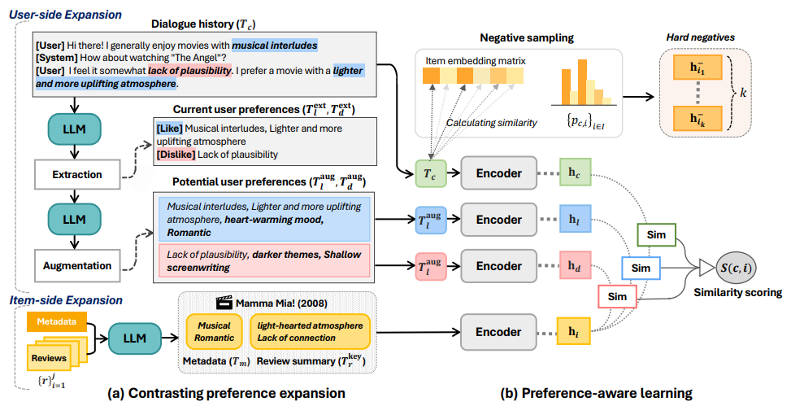

# 🪸 Empowering Retrieval-based Conversational Recommendation with Contrasting User Preferences (NAACL'25)

This is the official repository for the NAACL 2025 paper:
[Empowering Retrieval-based Conversational Recommendation with Contrasting User Preferences](https://arxiv.org/abs/2503.22005)

## 🧠 Overview

🪸CORAL is a retrieval-based CRS framework that explicitly represents and models the user, item, and contrasting preferences. 



For more details, please refer to our [📄paper](https://arxiv.org/abs/2503.22005), [🛝slide](assets/slide.pdf), and [🌐blog(Korean)](https://dial.skku.edu/blog/2025_coral).

## 📦 Installation 

```
git clone https://github.com/kookeej/CORAL.git
cd CORAL
conda create -n coral python=3.10
conda activate coral
pip install -r requirements.txt
```

## 🗃️ Dataset
The datasets used in this work are available on [Hugging Face](https://huggingface.co/datasets/kookeej/CORAL).

Please download and extract the datasets into the data/ folder as follows:

```
data/
├── pearl/
├── inspired/
└── redial/
```

## 🚀 Training
Run the training scripts for each dataset:

```
# Pearl
bash run_pearl.sh

# Inspired
bash run_inspired.sh

# Redial
bash run_redial.sh
```

## 🧾 Citation
If you find this work helpful, please cite our paper:
```
@inproceedings{kook-etal-2025-empowering,
    title = "Empowering Retrieval-based Conversational Recommendation with Contrasting User Preferences",
    author = "Kook, Heejin  and
      Kim, Junyoung  and
      Park, Seongmin  and
      Lee, Jongwuk",
    booktitle = "Proceedings of the 2025 Conference of the Nations of the Americas Chapter of the Association for Computational Linguistics: Human Language Technologies (Volume 1: Long Papers)",
    month = apr,
    year = "2025",
    address = "Albuquerque, New Mexico",
    publisher = "Association for Computational Linguistics",
    url = "https://aclanthology.org/2025.naacl-long.392/",
    pages = "7692--7707",
    ISBN = "979-8-89176-189-6",
}

```
